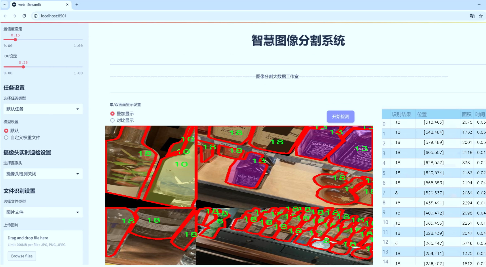
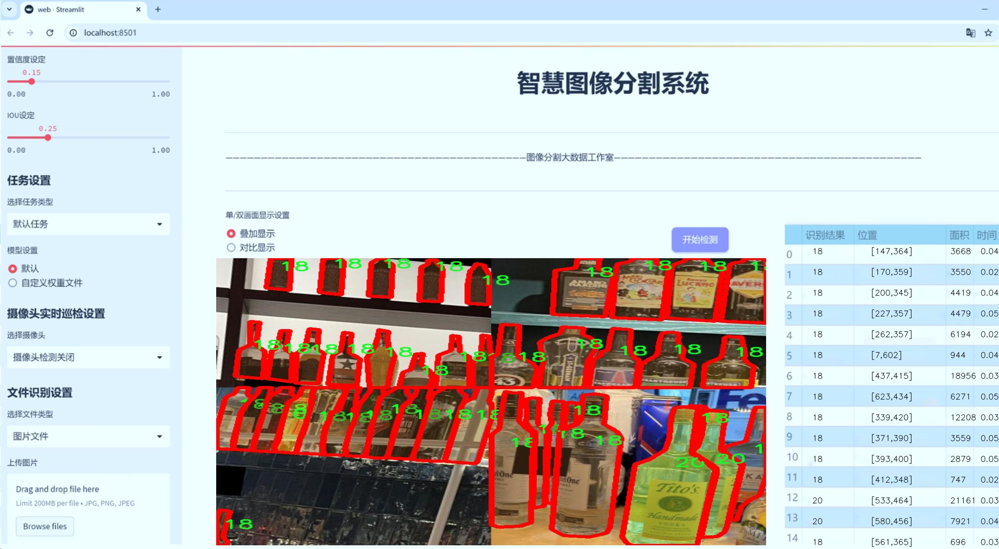
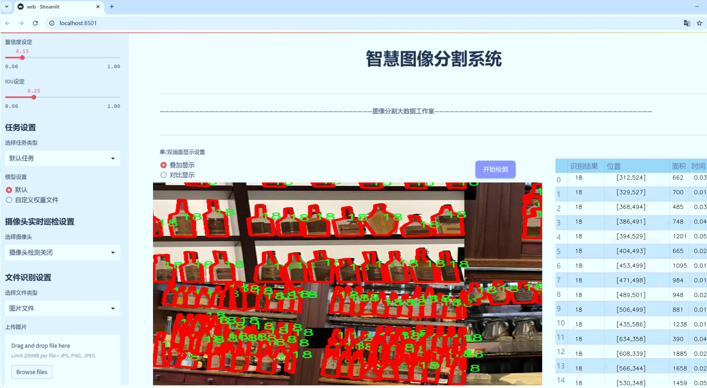
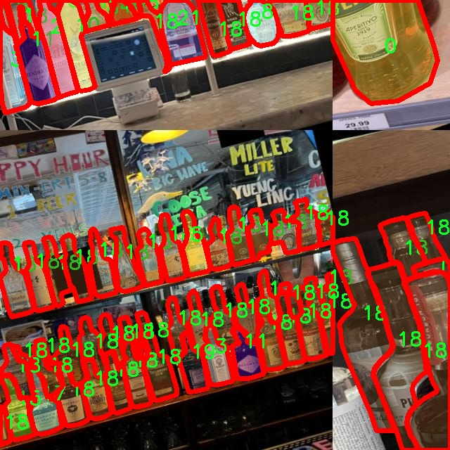
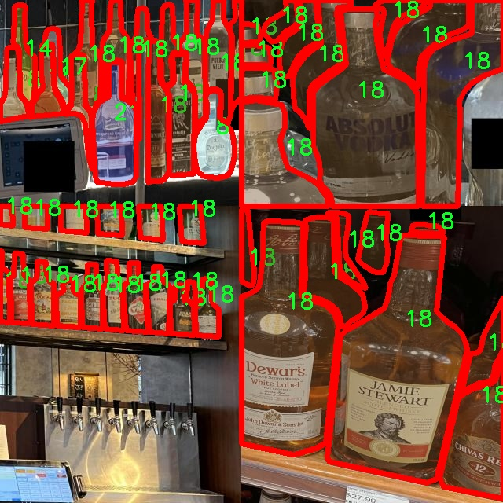
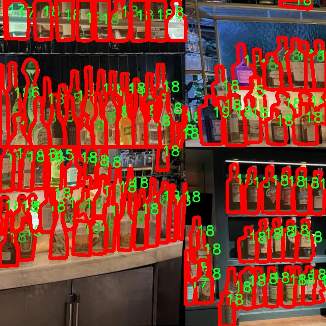
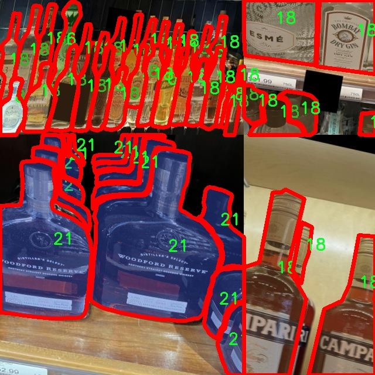
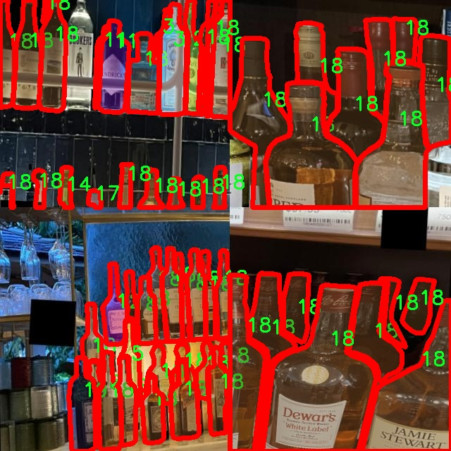

# 酒瓶类型分类图像分割系统： yolov8-seg-C2f-DiverseBranchBlock

### 1.研究背景与意义

[参考博客](https://gitee.com/YOLOv8_YOLOv11_Segmentation_Studio/projects)

[博客来源](https://kdocs.cn/l/cszuIiCKVNis)

研究背景与意义

随着人工智能技术的迅猛发展，计算机视觉在各个领域的应用日益广泛，尤其是在物体检测与图像分割方面。YOLO（You Only Look Once）系列模型因其高效的实时处理能力和优越的检测精度，成为了当前目标检测领域的热门选择。YOLOv8作为该系列的最新版本，进一步提升了模型的性能，尤其在复杂场景下的物体识别与分割任务中展现出良好的效果。然而，针对特定应用场景的模型改进与优化仍然是当前研究的热点之一。

酒瓶作为一种常见的物品，其种类繁多，形状、颜色和标签设计各异。在酒类市场的快速发展背景下，酒瓶的自动分类与识别成为了行业亟待解决的问题。传统的人工分类方法不仅效率低下，而且容易受到人为因素的影响，导致分类准确性不高。因此，基于深度学习的自动化图像分类与分割系统的构建显得尤为重要。

本研究旨在基于改进的YOLOv8模型，构建一个高效的酒瓶类型分类图像分割系统。我们将利用FOLDR数据集，该数据集包含1000张图像，涵盖22种不同类型的酒瓶，能够为模型的训练与测试提供丰富的样本。这些图像的多样性不仅有助于提升模型的泛化能力，还能有效应对实际应用中可能遇到的各种复杂情况。通过对YOLOv8模型的改进，我们将探索如何更好地提取酒瓶的特征信息，从而实现更高精度的分类与分割。

研究的意义不仅体现在技术层面，更在于其对实际应用的推动作用。首先，酒瓶类型的自动分类与分割系统能够显著提高酒类生产与销售环节的效率，降低人工成本，提升企业的竞争力。其次，该系统的成功应用将为其他类似物品的自动识别与分类提供借鉴，推动计算机视觉技术在更多领域的应用。此外，基于深度学习的图像处理技术在酒瓶分类中的应用，也将为相关学术研究提供新的思路与方法，促进学术界与工业界的深度合作。

综上所述，基于改进YOLOv8的酒瓶类型分类图像分割系统的研究，不仅具有重要的理论价值，还有着广泛的实际应用前景。通过深入探索该领域的技术难点与创新点，我们希望能够为酒类行业的智能化发展贡献一份力量，同时推动计算机视觉技术的进一步发展与应用。

### 2.图片演示







注意：本项目提供完整的训练源码数据集和训练教程,由于此博客编辑较早,暂不提供权重文件（best.pt）,需要按照6.训练教程进行训练后实现上图效果。

### 3.视频演示

[3.1 视频演示](https://www.bilibili.com/video/BV1KJm2YeEzW/)

### 4.数据集信息

##### 4.1 数据集类别数＆类别名

nc: 22
names: ['0', '1', '10', '11', '12', '13', '14', '15', '16', '17', '18', '19', '2', '20', '21', '3', '4', '5', '6', '7', '8', '9']


##### 4.2 数据集信息简介

数据集信息展示

在本研究中，我们使用了名为“FOLDR”的数据集，以支持改进YOLOv8-seg的酒瓶类型分类图像分割系统的训练。该数据集专门设计用于处理酒瓶图像的分类与分割任务，具有多样化的样本和丰富的标签信息，为模型的训练提供了坚实的基础。FOLDR数据集包含22个类别，具体类别标识符为从‘0’到‘21’的数字，这些类别代表了不同类型的酒瓶。每个类别都经过精心标注，确保在图像分割任务中能够准确识别和分类。

数据集的多样性体现在其涵盖的酒瓶类型上，能够有效地模拟现实世界中酒瓶的多样性和复杂性。类别的设计不仅考虑了酒瓶的形状和颜色，还包括了不同品牌和类型的酒瓶，例如红酒、白酒、香槟等。这种多样性使得模型在训练过程中能够学习到更为丰富的特征，从而提高其在实际应用中的表现。

在数据集的构建过程中，图像的采集和标注是至关重要的环节。FOLDR数据集中的图像来源于多个不同的环境和背景，确保了数据的广泛性和代表性。每一张图像都经过专业的标注，确保酒瓶的边界清晰可见，并且标注的准确性为后续的模型训练提供了保障。这样的标注方式不仅提高了模型的分割精度，也为分类任务奠定了良好的基础。

此外，FOLDR数据集还包含了多种拍摄角度和光照条件下的酒瓶图像，这对于训练一个鲁棒性强的模型至关重要。通过引入不同的拍摄条件，模型能够学习到在各种环境下如何准确识别和分割酒瓶。这种对环境变化的适应能力是实现高效图像分割的关键，尤其是在实际应用中，酒瓶的拍摄条件往往不可控。

在训练过程中，FOLDR数据集的使用不仅限于模型的初始训练，还可以通过数据增强技术进一步扩展数据集的有效性。通过旋转、缩放、翻转等操作，研究人员可以生成更多的训练样本，从而提高模型的泛化能力。这种灵活性使得FOLDR数据集在图像分割任务中具有极大的应用潜力。

总之，FOLDR数据集以其丰富的类别、精确的标注和多样的拍摄条件，为改进YOLOv8-seg的酒瓶类型分类图像分割系统提供了强有力的支持。通过对该数据集的深入分析和利用，我们期望能够显著提升模型在酒瓶图像分割和分类任务中的性能，推动相关领域的研究和应用进展。











### 5.项目依赖环境部署教程（零基础手把手教学）

[5.1 环境部署教程链接（零基础手把手教学）](https://www.bilibili.com/video/BV1jG4Ve4E9t/?vd_source=bc9aec86d164b67a7004b996143742dc)


[5.2 安装Python虚拟环境创建和依赖库安装视频教程链接（零基础手把手教学）](https://www.bilibili.com/video/BV1nA4VeYEze/?vd_source=bc9aec86d164b67a7004b996143742dc)

### 6.手把手YOLOV8-seg训练视频教程（零基础手把手教学）

[6.1 手把手YOLOV8-seg训练视频教程（零基础小白有手就能学会）](https://www.bilibili.com/video/BV1cA4VeYETe/?vd_source=bc9aec86d164b67a7004b996143742dc)


按照上面的训练视频教程链接加载项目提供的数据集，运行train.py即可开始训练



     Epoch   gpu_mem       box       obj       cls    labels  img_size
     1/200     0G   0.01576   0.01955  0.007536        22      1280: 100%|██████████| 849/849 [14:42<00:00,  1.04s/it]
               Class     Images     Labels          P          R     mAP@.5 mAP@.5:.95: 100%|██████████| 213/213 [01:14<00:00,  2.87it/s]
                 all       3395      17314      0.994      0.957      0.0957      0.0843

     Epoch   gpu_mem       box       obj       cls    labels  img_size
     2/200     0G   0.01578   0.01923  0.007006        22      1280: 100%|██████████| 849/849 [14:44<00:00,  1.04s/it]
               Class     Images     Labels          P          R     mAP@.5 mAP@.5:.95: 100%|██████████| 213/213 [01:12<00:00,  2.95it/s]
                 all       3395      17314      0.996      0.956      0.0957      0.0845

     Epoch   gpu_mem       box       obj       cls    labels  img_size
     3/200     0G   0.01561    0.0191  0.006895        27      1280: 100%|██████████| 849/849 [10:56<00:00,  1.29it/s]
               Class     Images     Labels          P          R     mAP@.5 mAP@.5:.95: 100%|███████   | 187/213 [00:52<00:00,  4.04it/s]
                 all       3395      17314      0.996      0.957      0.0957      0.0845


### 7.50+种全套YOLOV8-seg创新点加载调参实验视频教程（一键加载写好的改进模型的配置文件）

[7.1 50+种全套YOLOV8-seg创新点加载调参实验视频教程（一键加载写好的改进模型的配置文件）](https://www.bilibili.com/video/BV1Hw4VePEXv/?vd_source=bc9aec86d164b67a7004b996143742dc)

### YOLOV8-seg算法简介

原始YOLOv8-seg算法原理

YOLOv8-seg是YOLO系列中的最新版本，旨在为目标检测和实例分割任务提供更高的精度和更快的处理速度。该算法在YOLOv7的基础上进行了多项重要的改进，采用了更深的卷积神经网络结构，使得其在处理复杂场景时能够更有效地提取特征。YOLOv8-seg的设计理念是将整个图像作为输入，直接在图像上进行目标检测和定位，而不需要使用传统的滑动窗口或区域提议方法，这一创新显著提高了检测的精度和速度。

YOLOv8-seg的核心在于其独特的网络架构，包括输入层、主干网络、特征融合层和解耦头。首先，输入层负责将图像转换为固定大小的张量，通常为640x640的RGB图像，以便后续处理。主干网络采用了CSPDarknet结构，结合了YOLOv5中的C3模块和YOLOv7的ELAN思想，使用C2f模块替代了C3模块。C2f模块通过引入更多的跳层连接和分支结构，增强了特征的流动性和重用性，从而在保持轻量化的同时不牺牲检测精度。

在特征融合方面，YOLOv8-seg采用了PAN-FPN结构，能够有效地融合不同层次的特征信息。该结构通过自下而上的方式将高层特征与中层和浅层特征进行融合，使得网络能够同时捕捉到目标的细节信息和语义信息。特征融合的过程不仅提升了检测的准确性，还增强了对小目标的检测能力，尤其是在复杂背景下。

YOLOv8-seg的另一个显著创新是其解耦头的设计。与传统的Anchor-Based方法不同，YOLOv8-seg采用了Anchor-Free的思想，取消了之前的objectness分支，转而使用解耦的分类和回归分支。这一改变使得模型在进行目标分类和边框回归时更加灵活，并且减少了计算复杂度。解耦头的输出包括三个不同尺度的特征图，分别为80x80、40x40和20x20，能够适应不同大小的目标检测需求。

为了进一步提升模型的性能，YOLOv8-seg引入了新的损失函数，包括VFLLoss和DFLLoss+CIoULoss。这些损失函数在处理样本不平衡和困难样本时表现出色，能够有效提高模型的收敛速度和检测精度。此外，YOLOv8-seg还采用了Task-Aligned的样本匹配策略，使得模型在训练过程中能够更好地适应不同任务的需求。

在数据预处理方面，YOLOv8-seg使用了YOLOv5的增强策略，包括马赛克增强、混合增强、空间扰动和颜色扰动等。这些数据增强技术能够有效提高模型的鲁棒性，使其在面对不同场景和条件时依然能够保持良好的检测性能。

综上所述，YOLOv8-seg通过深度优化网络结构、引入先进的特征融合和解耦头设计、以及改进损失函数等多项创新，显著提升了目标检测和实例分割的性能。其在精度和速度上的优越表现，使其成为计算机视觉领域中最先进的模型之一，广泛应用于智能监控、自动驾驶和人脸识别等多个场景。随着YOLOv8-seg的不断发展和完善，未来在目标检测和实例分割任务中，预计将会有更广泛的应用前景和更深远的影响。


### 9.系统功能展示（检测对象为举例，实际内容以本项目数据集为准）

图9.1.系统支持检测结果表格显示

  图9.2.系统支持置信度和IOU阈值手动调节

  图9.3.系统支持自定义加载权重文件best.pt(需要你通过步骤5中训练获得)

  图9.4.系统支持摄像头实时识别

  图9.5.系统支持图片识别

  图9.6.系统支持视频识别

  图9.7.系统支持识别结果文件自动保存

  图9.8.系统支持Excel导出检测结果数据


### 10.50+种全套YOLOV8-seg创新点原理讲解（非科班也可以轻松写刊发刊，V11版本正在科研待更新）

#### 10.1 由于篇幅限制，每个创新点的具体原理讲解就不一一展开，具体见下列网址中的创新点对应子项目的技术原理博客网址【Blog】：


[10.1 50+种全套YOLOV8-seg创新点原理讲解链接](https://gitee.com/qunmasj/good)

#### 10.2 部分改进模块原理讲解(完整的改进原理见上图和技术博客链接)【如果此小节的图加载失败可以通过CSDN或者Github搜索该博客的标题访问原始博客，原始博客图片显示正常】
### FasterNet简介
神经网络在图像分类、检测和分割等各种计算机视觉任务中经历了快速发展。尽管其令人印象深刻的性能为许多应用程序提供了动力，但一个巨大的趋势是追求具有低延迟和高吞吐量的快速神经网络，以获得良好的用户体验、即时响应和安全原因等。

如何快速？研究人员和从业者不需要更昂贵的计算设备，而是倾向于设计具有成本效益的快速神经网络，降低计算复杂度，主要以浮点运算（FLOPs）的数量来衡量。

MobileNet、ShuffleNet和GhostNet等利用深度卷积（DWConv）和/或组卷积（GConv）来提取空间特征。然而，在减少FLOPs的过程中，算子经常会受到内存访问增加的副作用的影响。MicroNet进一步分解和稀疏网络，将其FLOPs推至极低水平。尽管这种方法在FLOPs方面有所改进，但其碎片计算效率很低。此外，上述网络通常伴随着额外的数据操作，如级联、Shuffle和池化，这些操作的运行时间对于小型模型来说往往很重要。

除了上述纯卷积神经网络（CNNs）之外，人们对使视觉Transformer（ViTs）和多层感知器（MLP）架构更小更快也越来越感兴趣。例如，MobileViT和MobileFormer通过将DWConv与改进的注意力机制相结合，降低了计算复杂性。然而，它们仍然受到DWConv的上述问题的困扰，并且还需要修改的注意力机制的专用硬件支持。使用先进但耗时的标准化和激活层也可能限制其在设备上的速度。

所有这些问题一起导致了以下问题：这些“快速”的神经网络真的很快吗？为了回答这个问题，作者检查了延迟和FLOPs之间的关系，这由


其中FLOPS是每秒浮点运算的缩写，作为有效计算速度的度量。虽然有许多减少FLOPs的尝试，但都很少考虑同时优化FLOPs以实现真正的低延迟。为了更好地理解这种情况，作者比较了Intel CPU上典型神经网络的FLOPS。


图中的结果表明，许多现有神经网络的FLOPS较低，其FLOPS通常低于流行的ResNet50。由于FLOPS如此之低，这些“快速”的神经网络实际上不够快。它们的FLOPs减少不能转化为延迟的确切减少量。在某些情况下，没有任何改善，甚至会导致更糟的延迟。例如，CycleMLP-B1具有ResNet50的一半FLOPs，但运行速度较慢（即CycleMLPB1与ResNet50:111.9ms与69.4ms）。

请注意，FLOPs与延迟之间的差异在之前的工作中也已被注意到，但由于它们采用了DWConv/GConv和具有低FLOPs的各种数据处理，因此部分问题仍未解决。人们认为没有更好的选择。

该博客提供的方案通过开发一种简单、快速、有效的运算符来消除这种差异，该运算符可以在减少FLOPs的情况下保持高FLOPS。

具体来说，作者重新审视了现有的操作符，特别是DWConv的计算速度——FLOPS。作者发现导致低FLOPS问题的主要原因是频繁的内存访问。然后，作者提出了PConv作为一种竞争性替代方案，它减少了计算冗余以及内存访问的数量。

图1说明了PConv的设计。它利用了特征图中的冗余，并系统地仅在一部分输入通道上应用规则卷积（Conv），而不影响其余通道。本质上，PConv的FLOPs低于常规Conv，而FLOPs高于DWConv/GConv。换句话说，PConv更好地利用了设备上的计算能力。PConv在提取空间特征方面也很有效，这在本文后面的实验中得到了验证。

作者进一步引入PConv设计了FasterNet作为一个在各种设备上运行速度非常快的新网络家族。特别是，FasterNet在分类、检测和分割任务方面实现了最先进的性能，同时具有更低的延迟和更高的吞吐量。例如，在GPU、CPU和ARM处理器上，小模型FasterNet-T0分别比MobileVitXXS快3.1倍、3.1倍和2.5倍，而在ImageNet-1k上的准确率高2.9%。大模型FasterNet-L实现了83.5%的Top-1精度，与Swin-B不相上下，同时在GPU上提供了49%的高吞吐量，在CPU上节省了42%的计算时间。

总之，贡献如下：

指出了实现更高FLOPS的重要性，而不仅仅是为了更快的神经网络而减少FLOPs。

引入了一种简单但快速且有效的卷积PConv，它很有可能取代现有的选择DWConv。

推出FasterNet，它在GPU、CPU和ARM处理器等多种设备上运行良好且普遍快速。

对各种任务进行了广泛的实验，并验证了PConv和FasterNet的高速性和有效性。

### Conv和FasterNet的设计
#### 原理

DWConv是Conv的一种流行变体，已被广泛用作许多神经网络的关键构建块。对于输入，DWConv应用个滤波器来计算输出。如图（b）所示，每个滤波器在一个输入通道上进行空间滑动，并对一个输出通道做出贡献。

与具有的FLOPs常规Conv相比，这种深度计算使得DWConv仅仅具有的FLOPs。虽然在减少FLOPs方面有效，但DWConv（通常后跟逐点卷积或PWConv）不能简单地用于替换常规Conv，因为它会导致严重的精度下降。因此，在实践中，DWConv的通道数（或网络宽度）增加到＞以补偿精度下降，例如，倒置残差块中的DWConv宽度扩展了6倍。然而，这会导致更高的内存访问，这会造成不可忽略的延迟，并降低总体计算速度，尤其是对于I/O绑定设备。特别是，内存访问的数量现在上升到


它比一个常规的Conv的值要高，即，


注意，内存访问花费在I/O操作上，这被认为已经是最小的成本，很难进一步优化。

#### PConv作为一个基本的算子


在下面演示了通过利用特征图的冗余度可以进一步优化成本。如图所示，特征图在不同通道之间具有高度相似性。许多其他著作也涵盖了这种冗余，但很少有人以简单而有效的方式充分利用它。


具体而言，作者提出了一种简单的PConv，以同时减少计算冗余和内存访问。图4中的左下角说明了PConv的工作原理。它只需在输入通道的一部分上应用常规Conv进行空间特征提取，并保持其余通道不变。对于连续或规则的内存访问，将第一个或最后一个连续的通道视为整个特征图的代表进行计算。在不丧失一般性的情况下认为输入和输出特征图具有相同数量的通道。因此，PConv的FLOPs仅


对于典型的r＝1/4 ，PConv的FLOPs只有常规Conv的1/16。此外，PConv的内存访问量较小，即：


对于r＝1/4，其仅为常规Conv的1/4。

由于只有通道用于空间特征提取，人们可能会问是否可以简单地移除剩余的（c−）通道？如果是这样，PConv将退化为具有较少通道的常规Conv，这偏离了减少冗余的目标。

请注意，保持其余通道不变，而不是从特征图中删除它们。这是因为它们对后续PWConv层有用，PWConv允许特征信息流经所有通道。

#### PConv之后是PWConv


为了充分有效地利用来自所有通道的信息，进一步将逐点卷积（PWConv）附加到PConv。它们在输入特征图上的有效感受野看起来像一个T形Conv，与均匀处理补丁的常规Conv相比，它更专注于中心位置，如图5所示。为了证明这个T形感受野的合理性，首先通过计算位置的Frobenius范数来评估每个位置的重要性。


假设，如果一个职位比其他职位具有更大的Frobenius范数，则该职位往往更重要。对于正则Conv滤波器，位置处的Frobenius范数由计算，其中。


一个显著位置是具有最大Frobenius范数的位置。然后，在预训练的ResNet18中集体检查每个过滤器，找出它们的显著位置，并绘制显著位置的直方图。图6中的结果表明，中心位置是过滤器中最常见的突出位置。换句话说，中心位置的权重比周围的更重。这与集中于中心位置的T形计算一致。

虽然T形卷积可以直接用于高效计算，但作者表明，将T形卷积分解为PConv和PWConv更好，因为该分解利用了滤波器间冗余并进一步节省了FLOPs。对于相同的输入和输出，T形Conv的FLOPs可以计算为:


它高于PConv和PWConv的流量，即：


其中和（例如，当时）。此外，可以很容易地利用常规Conv进行两步实现。

# FasterNet作为Backbone
鉴于新型PConv和现成的PWConv作为主要的算子，进一步提出FasterNet，这是一个新的神经网络家族，运行速度非常快，对许多视觉任务非常有效。目标是使体系结构尽可能简单，使其总体上对硬件友好。


在图中展示了整体架构。它有4个层次级，每个层次级前面都有一个嵌入层（步长为4的常规4×4卷积）或一个合并层（步长为2的常规2×2卷积），用于空间下采样和通道数量扩展。每个阶段都有一堆FasterNet块。作者观察到，最后两个阶段中的块消耗更少的内存访问，并且倾向于具有更高的FLOPS，如表1中的经验验证。因此，放置了更多FasterNet块，并相应地将更多计算分配给最后两个阶段。每个FasterNet块有一个PConv层，后跟2个PWConv（或Conv 1×1）层。它们一起显示为倒置残差块，其中中间层具有扩展的通道数量，并且放置了Shorcut以重用输入特征。

除了上述算子，标准化和激活层对于高性能神经网络也是不可或缺的。然而，许多先前的工作在整个网络中过度使用这些层，这可能会限制特征多样性，从而损害性能。它还可以降低整体计算速度。相比之下，只将它们放在每个中间PWConv之后，以保持特征多样性并实现较低的延迟。

此外，使用批次归一化（BN）代替其他替代方法。BN的优点是，它可以合并到其相邻的Conv层中，以便更快地进行推断，同时与其他层一样有效。对于激活层，根据经验选择了GELU用于较小的FasterNet变体，而ReLU用于较大的FasterNet变体，同时考虑了运行时间和有效性。最后三个层，即全局平均池化、卷积1×1和全连接层，一起用于特征转换和分类。

为了在不同的计算预算下提供广泛的应用，提供FasterNet的Tiny模型、Small模型、Medium模型和Big模型变体，分别称为FasterNetT0/1/2、FasterNet-S、FasterNet-M和FasterNet-L。它们具有相似的结构，但深度和宽度不同。

架构规范如下：


### 11.项目核心源码讲解（再也不用担心看不懂代码逻辑）

#### 11.1 ultralytics\models\rtdetr\model.py

以下是对给定代码的核心部分进行分析和详细注释的结果：

```python
# Ultralytics YOLO 🚀, AGPL-3.0 license
"""
RT-DETR接口，基于视觉变换器的实时目标检测器。RT-DETR提供实时性能和高准确性，
在CUDA和TensorRT等加速后端中表现优异。它具有高效的混合编码器和IoU感知查询选择，
以提高检测准确性。

有关RT-DETR的更多信息，请访问：https://arxiv.org/pdf/2304.08069.pdf
"""

# 从Ultralytics库中导入模型和任务相关的类
from ultralytics.engine.model import Model
from ultralytics.nn.tasks import RTDETRDetectionModel

# 导入预测、训练和验证模块
from .predict import RTDETRPredictor
from .train import RTDETRTrainer
from .val import RTDETRValidator


class RTDETR(Model):
    """
    RT-DETR模型的接口。该基于视觉变换器的目标检测器提供实时性能和高准确性。
    支持高效的混合编码、IoU感知查询选择和可调的推理速度。

    属性:
        model (str): 预训练模型的路径。默认为'rtdetr-l.pt'。
    """

    def __init__(self, model='rtdetr-l.pt') -> None:
        """
        使用给定的预训练模型文件初始化RT-DETR模型。支持.pt和.yaml格式。

        参数:
            model (str): 预训练模型的路径。默认为'rtdetr-l.pt'。

        异常:
            NotImplementedError: 如果模型文件扩展名不是'pt'、'yaml'或'yml'。
        """
        # 检查模型文件的扩展名是否有效
        if model and model.split('.')[-1] not in ('pt', 'yaml', 'yml'):
            raise NotImplementedError('RT-DETR仅支持从*.pt、*.yaml或*.yml文件创建。')
        # 调用父类的初始化方法
        super().__init__(model=model, task='detect')

    @property
    def task_map(self) -> dict:
        """
        返回RT-DETR的任务映射，将任务与相应的Ultralytics类关联。

        返回:
            dict: 一个字典，将任务名称映射到RT-DETR模型的Ultralytics任务类。
        """
        return {
            'detect': {
                'predictor': RTDETRPredictor,  # 预测器类
                'validator': RTDETRValidator,   # 验证器类
                'trainer': RTDETRTrainer,       # 训练器类
                'model': RTDETRDetectionModel    # 检测模型类
            }
        }
```

### 代码分析
1. **模块导入**: 代码首先导入了必要的类和模块，包括模型基类和特定于RT-DETR的预测、训练和验证类。

2. **RTDETR类**: 这是RT-DETR模型的主要接口，继承自`Model`类。它定义了模型的初始化和任务映射。

3. **初始化方法**: 在`__init__`方法中，检查传入的模型文件扩展名是否合法（支持`.pt`、`.yaml`和`.yml`）。如果不合法，则抛出`NotImplementedError`异常。

4. **任务映射**: `task_map`属性返回一个字典，映射了检测任务到相应的类。这使得在使用RT-DETR进行目标检测时，可以方便地调用不同的功能模块。

通过这些核心部分和注释，可以更好地理解RT-DETR模型的结构和功能。

该文件是Ultralytics YOLO框架中的一个模块，专门用于实现百度的RT-DETR模型。RT-DETR是一种基于视觉变换器（Vision Transformer）的实时目标检测器，旨在提供高效的实时性能和高准确度，特别是在使用CUDA和TensorRT等加速后端时表现优异。该模型采用了高效的混合编码器和IoU（Intersection over Union）感知的查询选择机制，以提升检测的准确性。

在文件的开头，首先引入了必要的模块，包括Ultralytics引擎中的模型类、RT-DETR检测模型、预测器、训练器和验证器。这些模块为RT-DETR的实现提供了基础。

接下来定义了一个名为RTDETR的类，该类继承自Ultralytics的Model类。RTDETR类的构造函数接受一个参数`model`，用于指定预训练模型的路径，默认值为'rtdetr-l.pt'。在构造函数中，首先检查提供的模型文件扩展名是否为支持的格式（.pt、.yaml或.yml），如果不符合要求，则抛出一个`NotImplementedError`异常。通过调用父类的构造函数，RTDETR类初始化为一个检测任务。

该类还定义了一个名为`task_map`的属性，返回一个字典，该字典将任务名称映射到相应的Ultralytics任务类。这些任务包括预测器、验证器和训练器，分别对应于RTDETR模型的预测、验证和训练功能。

总的来说，这个文件为RT-DETR模型提供了一个接口，整合了模型的加载、任务管理和功能扩展，使得用户能够方便地使用该模型进行目标检测任务。

#### 11.2 ultralytics\models\fastsam\__init__.py

以下是保留的核心代码部分，并附上详细的中文注释：

```python
# 导入必要的模块和类
from .model import FastSAM  # 导入FastSAM模型类
from .predict import FastSAMPredictor  # 导入FastSAMPredictor类，用于进行预测
from .prompt import FastSAMPrompt  # 导入FastSAMPrompt类，用于处理提示信息
from .val import FastSAMValidator  # 导入FastSAMValidator类，用于验证模型性能

# 定义模块的公开接口，用户可以直接使用这些类
__all__ = 'FastSAMPredictor', 'FastSAM', 'FastSAMPrompt', 'FastSAMValidator'
```

### 代码详细注释说明：

1. **导入模块**：
   - `from .model import FastSAM`：从当前包的`model`模块中导入`FastSAM`类，这个类通常是模型的定义和结构。
   - `from .predict import FastSAMPredictor`：从`predict`模块中导入`FastSAMPredictor`类，该类负责使用`FastSAM`模型进行预测。
   - `from .prompt import FastSAMPrompt`：从`prompt`模块中导入`FastSAMPrompt`类，这个类可能用于处理用户输入的提示信息，以便更好地指导模型进行预测。
   - `from .val import FastSAMValidator`：从`val`模块中导入`FastSAMValidator`类，该类用于评估和验证模型的性能，确保模型的输出符合预期。

2. **定义公开接口**：
   - `__all__`变量用于定义模块的公共接口，指定哪些类可以被外部导入。这里列出了四个类：`FastSAMPredictor`、`FastSAM`、`FastSAMPrompt`和`FastSAMValidator`，这意味着用户在使用`from module_name import *`时，只会导入这四个类。

这个程序文件是一个Python模块的初始化文件，位于`ultralytics/models/fastsam`目录下。它的主要功能是导入和组织与FastSAM相关的类和功能，以便在其他地方使用。

首先，文件顶部的注释部分提到这是Ultralytics YOLO的一部分，并且使用的是AGPL-3.0许可证。这表明该代码是与YOLO（You Only Look Once）系列模型相关的，YOLO是一种流行的目标检测算法。

接下来，文件通过`from .model import FastSAM`语句导入了`FastSAM`类，这个类可能是FastSAM模型的核心实现。然后，通过`from .predict import FastSAMPredictor`导入了`FastSAMPredictor`类，这个类可能用于对输入数据进行预测。

文件还导入了`FastSAMPrompt`和`FastSAMValidator`，分别来自`prompt`和`val`模块。这两个类可能分别用于处理输入提示和验证模型的性能。

最后，`__all__`变量定义了模块的公共接口，列出了可以被外部导入的类。这意味着，当其他模块使用`from ultralytics.models.fastsam import *`时，只会导入`FastSAMPredictor`、`FastSAM`、`FastSAMPrompt`和`FastSAMValidator`这四个类，而不会导入模块中的其他内容。

总的来说，这个初始化文件的作用是整合和暴露与FastSAM相关的功能，使得其他模块可以方便地使用这些功能。

#### 11.3 ultralytics\utils\ops.py

以下是代码中最核心的部分，并附上详细的中文注释：

```python
import torch
import torchvision

def non_max_suppression(
        prediction,
        conf_thres=0.25,
        iou_thres=0.45,
        classes=None,
        agnostic=False,
        multi_label=False,
        labels=(),
        max_det=300,
        nc=0,  # 类别数量（可选）
        max_time_img=0.05,
        max_nms=30000,
        max_wh=7680,
):
    """
    对一组边界框执行非最大抑制（NMS），支持掩码和每个框多个标签。

    参数:
        prediction (torch.Tensor): 形状为 (batch_size, num_classes + 4 + num_masks, num_boxes) 的张量，
            包含预测的框、类别和掩码。张量格式应与模型输出格式一致，例如 YOLO。
        conf_thres (float): 置信度阈值，低于该值的框将被过滤掉。
        iou_thres (float): IoU 阈值，低于该值的框在 NMS 过程中将被过滤掉。
        classes (List[int]): 要考虑的类别索引列表。如果为 None，则考虑所有类别。
        agnostic (bool): 如果为 True，模型对类别数量不敏感，所有类别将被视为一个类别。
        multi_label (bool): 如果为 True，每个框可能有多个标签。
        labels (List[List[Union[int, float, torch.Tensor]]]): 每个图像的先验标签列表。
        max_det (int): NMS 后要保留的最大框数量。
        nc (int, optional): 模型输出的类别数量。任何超过此数量的索引将被视为掩码。
        max_time_img (float): 处理一张图像的最大时间（秒）。
        max_nms (int): 传递给 torchvision.ops.nms() 的最大框数量。
        max_wh (int): 最大框宽度和高度（像素）。

    返回:
        (List[torch.Tensor]): 长度为 batch_size 的列表，每个元素是形状为 (num_boxes, 6 + num_masks) 的张量，
            包含保留的框，列为 (x1, y1, x2, y2, confidence, class, mask1, mask2, ...)。
    """

    # 检查置信度和IoU阈值是否有效
    assert 0 <= conf_thres <= 1, f'Invalid Confidence threshold {conf_thres}, valid values are between 0.0 and 1.0'
    assert 0 <= iou_thres <= 1, f'Invalid IoU {iou_thres}, valid values are between 0.0 and 1.0'
    
    # 如果预测结果是列表或元组，则选择推理输出
    if isinstance(prediction, (list, tuple)):
        prediction = prediction[0]  # 选择推理输出

    device = prediction.device  # 获取设备信息
    mps = 'mps' in device.type  # 检查是否为 Apple MPS
    if mps:  # 如果是 MPS，转换张量到 CPU 进行 NMS
        prediction = prediction.cpu()
    
    bs = prediction.shape[0]  # 批量大小
    nc = nc or (prediction.shape[1] - 4)  # 类别数量
    nm = prediction.shape[1] - nc - 4  # 掩码数量
    mi = 4 + nc  # 掩码起始索引
    xc = prediction[:, 4:mi].amax(1) > conf_thres  # 置信度候选框

    # 设置
    time_limit = 0.5 + max_time_img * bs  # 超过此时间将退出
    multi_label &= nc > 1  # 如果类别数量大于1，则允许每个框有多个标签

    prediction = prediction.transpose(-1, -2)  # 转置张量形状
    prediction[..., :4] = xywh2xyxy(prediction[..., :4])  # 将xywh格式转换为xyxy格式

    output = [torch.zeros((0, 6 + nm), device=prediction.device)] * bs  # 初始化输出
    for xi, x in enumerate(prediction):  # 遍历每张图像的推理结果
        x = x[xc[xi]]  # 过滤掉低置信度的框

        # 如果存在先验标签，则将其添加到当前框中
        if labels and len(labels[xi]):
            lb = labels[xi]
            v = torch.zeros((len(lb), nc + nm + 4), device=x.device)
            v[:, :4] = xywh2xyxy(lb[:, 1:5])  # 转换框格式
            v[range(len(lb)), lb[:, 0].long() + 4] = 1.0  # 设置类别
            x = torch.cat((x, v), 0)  # 合并

        if not x.shape[0]:  # 如果没有框，继续处理下一张图像
            continue

        # 拆分检测矩阵
        box, cls, mask = x.split((4, nc, nm), 1)

        if multi_label:
            i, j = torch.where(cls > conf_thres)  # 获取多个标签的索引
            x = torch.cat((box[i], x[i, 4 + j, None], j[:, None].float(), mask[i]), 1)
        else:  # 仅保留最佳类别
            conf, j = cls.max(1, keepdim=True)
            x = torch.cat((box, conf, j.float(), mask), 1)[conf.view(-1) > conf_thres]

        # 根据类别过滤框
        if classes is not None:
            x = x[(x[:, 5:6] == torch.tensor(classes, device=x.device)).any(1)]

        n = x.shape[0]  # 当前框数量
        if not n:  # 如果没有框，继续处理下一张图像
            continue
        if n > max_nms:  # 如果框数量超过最大限制，按置信度排序并去除多余框
            x = x[x[:, 4].argsort(descending=True)[:max_nms]]

        # 批量执行 NMS
        c = x[:, 5:6] * (0 if agnostic else max_wh)  # 类别偏移
        boxes, scores = x[:, :4] + c, x[:, 4]  # 框和分数
        i = torchvision.ops.nms(boxes, scores, iou_thres)  # 执行 NMS
        i = i[:max_det]  # 限制检测框数量

        output[xi] = x[i]  # 保存结果
        if (time.time() - t) > time_limit:  # 超过时间限制，发出警告
            LOGGER.warning(f'WARNING ⚠️ NMS time limit {time_limit:.3f}s exceeded')
            break  # 超过时间限制，退出

    return output  # 返回处理后的结果
```

### 代码核心部分说明：
1. **非最大抑制 (NMS)**：该函数用于处理模型预测的边界框，去除重叠度高且置信度低的框，以提高检测精度。
2. **参数说明**：
   - `prediction`：模型的输出，包含边界框、类别和掩码信息。
   - `conf_thres` 和 `iou_thres`：用于过滤低置信度和低重叠度的框。
   - `classes`：指定要保留的类别。
   - `multi_label`：指示每个框是否可以有多个标签。
3. **处理流程**：
   - 先进行有效性检查。
   - 过滤掉低置信度的框。
   - 根据类别和置信度进一步筛选框。
   - 执行 NMS，最终返回保留的框。

通过这些注释，可以更好地理解代码的功能和逻辑。

这个程序文件是一个用于处理YOLO（You Only Look Once）模型相关操作的工具类，主要包含了图像处理、坐标转换、非极大值抑制（NMS）、性能分析等功能。文件中的主要类和函数如下：

首先，`Profile`类用于性能分析，可以作为装饰器或上下文管理器使用。它记录代码块的执行时间，方便开发者分析性能瓶颈。

`segment2box`函数将分割标签转换为边界框标签，确保边界框在图像内部，并返回最小和最大x、y值。

`scale_boxes`函数用于将边界框从一个图像的尺寸缩放到另一个图像的尺寸。它考虑了图像的宽高比和填充，确保边界框的正确性。

`make_divisible`函数用于将一个数值调整为可被指定除数整除的最接近的数值，这在处理网络层的输出时非常有用。

`non_max_suppression`函数实现了非极大值抑制，主要用于过滤重叠的边界框。它支持多标签和掩码，并可以根据置信度和IoU阈值进行过滤。

`clip_boxes`和`clip_coords`函数用于将边界框和坐标限制在图像的边界内，确保它们不会超出图像的范围。

`scale_image`函数将掩码调整为原始图像的大小，确保掩码与图像的尺寸一致。

`xyxy2xywh`和`xywh2xyxy`函数用于在不同的边界框表示格式之间进行转换，方便在不同的处理步骤中使用。

`segments2boxes`函数将分段标签转换为边界框标签，`resample_segments`函数用于对分段进行重采样，确保每个分段有相同数量的点。

`crop_mask`函数根据给定的边界框裁剪掩码，`process_mask`和`process_mask_upsample`函数则用于处理掩码的应用，确保掩码与边界框匹配。

`masks2segments`函数将掩码转换为分段，`convert_torch2numpy_batch`函数用于将PyTorch张量转换为NumPy数组，方便后续处理。

最后，`clean_str`函数用于清理字符串，替换特殊字符为下划线，确保字符串格式规范。

整体来看，这个文件提供了一系列工具函数，帮助开发者在使用YOLO模型进行目标检测时，处理图像、边界框和掩码等数据，提升模型的性能和准确性。

#### 11.4 ultralytics\trackers\__init__.py

以下是保留的核心代码部分，并添加了详细的中文注释：

```python
# 导入所需的跟踪器类
from .bot_sort import BOTSORT  # 导入 BOTSORT 跟踪器
from .byte_tracker import BYTETracker  # 导入 BYTETracker 跟踪器
from .track import register_tracker  # 导入注册跟踪器的函数

# 定义模块的公开接口，允许更简单的导入
__all__ = 'register_tracker', 'BOTSORT', 'BYTETracker'  
```

### 注释说明：
1. **导入部分**：
   - `from .bot_sort import BOTSORT`：从当前模块的 `bot_sort` 文件中导入 `BOTSORT` 类，这个类可能用于目标跟踪。
   - `from .byte_tracker import BYTETracker`：从当前模块的 `byte_tracker` 文件中导入 `BYTETracker` 类，可能是另一种目标跟踪的实现。
   - `from .track import register_tracker`：从当前模块的 `track` 文件中导入 `register_tracker` 函数，用于注册不同的跟踪器。

2. **`__all__` 的定义**：
   - `__all__` 是一个特殊变量，用于定义模块的公共接口。当使用 `from module import *` 时，只有在 `__all__` 中列出的名称会被导入。这使得模块的使用更加清晰，避免不必要的名称污染。

这个程序文件是Ultralytics YOLO项目中的一个初始化文件，位于`ultralytics/trackers`目录下。文件的主要功能是导入和注册跟踪器相关的类和函数，以便在其他模块中能够方便地使用。

首先，文件开头的注释部分表明这是Ultralytics YOLO项目的一部分，并且该项目遵循AGPL-3.0许可证。这种许可证允许用户自由使用、修改和分发软件，但要求在分发时也要保持相同的许可证。

接下来，文件通过相对导入的方式引入了三个重要的组件：`BOTSORT`、`BYTETracker`和`register_tracker`。`BOTSORT`和`BYTETracker`是两种不同的目标跟踪算法，分别实现了各自的跟踪逻辑。而`register_tracker`是一个函数，用于注册这些跟踪器，使得它们可以在其他部分的代码中被调用。

最后，`__all__`变量定义了当使用`from module import *`语句时，哪些名称会被导入。这里将`register_tracker`、`BOTSORT`和`BYTETracker`列入了`__all__`，这意味着这些名称是该模块的公共接口，用户可以直接使用它们，而不需要了解模块内部的实现细节。

总体来说，这个初始化文件的作用是组织和简化跟踪器的导入过程，使得其他模块在使用这些跟踪器时更加方便。

#### 11.5 ultralytics\utils\callbacks\hub.py

以下是代码中最核心的部分，并附上详细的中文注释：

```python
import json
from time import time
from ultralytics.hub.utils import HUB_WEB_ROOT, PREFIX, events
from ultralytics.utils import LOGGER, SETTINGS

def on_fit_epoch_end(trainer):
    """在每个训练周期结束时上传训练进度指标。"""
    session = getattr(trainer, 'hub_session', None)  # 获取训练器的会话对象
    if session:
        # 在验证结束后上传指标
        all_plots = {**trainer.label_loss_items(trainer.tloss, prefix='train'), **trainer.metrics}  # 收集训练损失和指标
        if trainer.epoch == 0:
            from ultralytics.utils.torch_utils import model_info_for_loggers
            all_plots = {**all_plots, **model_info_for_loggers(trainer)}  # 如果是第一个周期，添加模型信息
        session.metrics_queue[trainer.epoch] = json.dumps(all_plots)  # 将指标以JSON格式存入队列
        if time() - session.timers['metrics'] > session.rate_limits['metrics']:  # 检查是否超过上传限制
            session.upload_metrics()  # 上传指标
            session.timers['metrics'] = time()  # 重置计时器
            session.metrics_queue = {}  # 重置队列

def on_model_save(trainer):
    """以速率限制的方式将检查点保存到Ultralytics HUB。"""
    session = getattr(trainer, 'hub_session', None)  # 获取训练器的会话对象
    if session:
        # 上传检查点，遵循速率限制
        is_best = trainer.best_fitness == trainer.fitness  # 判断当前模型是否是最佳模型
        if time() - session.timers['ckpt'] > session.rate_limits['ckpt']:  # 检查是否超过上传限制
            LOGGER.info(f'{PREFIX}Uploading checkpoint {HUB_WEB_ROOT}/models/{session.model_id}')  # 记录上传信息
            session.upload_model(trainer.epoch, trainer.last, is_best)  # 上传模型
            session.timers['ckpt'] = time()  # 重置计时器

def on_train_end(trainer):
    """在训练结束时将最终模型和指标上传到Ultralytics HUB。"""
    session = getattr(trainer, 'hub_session', None)  # 获取训练器的会话对象
    if session:
        # 上传最终模型和指标
        LOGGER.info(f'{PREFIX}Syncing final model...')  # 记录同步信息
        session.upload_model(trainer.epoch, trainer.best, map=trainer.metrics.get('metrics/mAP50-95(B)', 0), final=True)  # 上传最终模型
        session.alive = False  # 停止心跳
        LOGGER.info(f'{PREFIX}Done ✅\n'
                    f'{PREFIX}View model at {HUB_WEB_ROOT}/models/{session.model_id} 🚀')  # 记录完成信息

# 回调函数字典，包含训练、验证、预测和导出开始时的事件
callbacks = {
    'on_fit_epoch_end': on_fit_epoch_end,
    'on_model_save': on_model_save,
    'on_train_end': on_train_end,
} if SETTINGS['hub'] is True else {}  # 验证是否启用
```

### 代码核心部分说明：
1. **`on_fit_epoch_end`**：在每个训练周期结束时上传训练指标。它会收集当前周期的损失和其他指标，并在达到速率限制时将其上传。
2. **`on_model_save`**：在训练过程中保存模型检查点，确保在上传时遵循速率限制。
3. **`on_train_end`**：在训练结束时上传最终模型和指标，并记录相关信息。

### 其他说明：
- 代码中使用了`session`对象来管理与Ultralytics HUB的交互，包括上传模型和指标。
- 使用了`time`模块来控制上传的速率限制，确保不会过于频繁地进行上传操作。

这个程序文件是一个用于Ultralytics YOLO（一个目标检测模型）的回调函数模块，主要负责在训练过程中与Ultralytics HUB进行交互，上传模型和训练进度的相关信息。文件中包含了一系列的回调函数，这些函数在特定的训练阶段被调用，以便记录和上传模型的状态和性能指标。

首先，`on_pretrain_routine_end`函数在预训练例程结束时被调用。它会检查训练器（trainer）是否有与HUB的会话，如果有，则记录模型的链接，并启动上传速率限制的计时器。

接下来，`on_fit_epoch_end`函数在每个训练周期结束时被调用。它会上传训练进度的指标，包括损失和其他性能指标。如果是第一个周期，还会记录模型的信息。函数会检查是否超过了上传速率限制，如果是，则调用上传函数，并重置计时器和指标队列。

`on_model_save`函数用于保存模型检查点，并确保遵循上传速率限制。它会检查当前模型是否是最佳模型，并在满足条件时上传模型检查点。

`on_train_end`函数在训练结束时被调用，负责上传最终的模型和指标到HUB，并停止心跳信号的发送，表示训练过程已完成。

此外，还有一些函数如`on_train_start`、`on_val_start`、`on_predict_start`和`on_export_start`，这些函数在训练、验证、预测和导出开始时被调用，主要用于执行与这些过程相关的事件。

最后，所有的回调函数被组织在一个字典中，只有在设置中启用了HUB功能时，这个字典才会被创建。这个设计使得程序在不同的环境下可以灵活地选择是否与HUB进行交互。

整体来看，这个模块的主要目的是通过回调机制在训练过程中自动上传模型和指标，以便用户能够实时监控训练进度和模型性能。

### 12.系统整体结构（节选）

### 整体功能和构架概括

Ultralytics YOLO项目是一个目标检测框架，旨在提供高效、灵活且易于使用的目标检测解决方案。该框架采用了多种先进的模型和算法，如RT-DETR和FastSAM，并提供了多种工具和功能，以支持训练、验证、预测和模型跟踪等任务。整体架构分为多个模块，每个模块负责特定的功能，使得代码结构清晰且易于维护。

- **模型模块**：包含不同的目标检测模型实现，如RT-DETR和FastSAM，负责模型的定义、训练和推理。
- **工具模块**：提供图像处理、坐标转换、非极大值抑制等功能，支持模型的输入输出处理。
- **跟踪模块**：实现目标跟踪算法，允许在视频流中持续跟踪目标。
- **回调模块**：与Ultralytics HUB进行交互，上传模型和训练进度的相关信息，支持实时监控。

### 文件功能整理表

| 文件路径                                     | 功能描述                                                                                       |
|------------------------------------------|--------------------------------------------------------------------------------------------|
| `ultralytics/models/rtdetr/model.py`   | 实现RT-DETR模型，提供模型加载、任务管理和功能扩展接口。                                            |
| `ultralytics/models/fastsam/__init__.py` | 整合FastSAM相关类和功能，提供公共接口以便于其他模块使用。                                          |
| `ultralytics/utils/ops.py`             | 提供图像处理、坐标转换、非极大值抑制等工具函数，支持模型的输入输出处理。                              |
| `ultralytics/trackers/__init__.py`     | 导入和注册目标跟踪器（如BOTSORT和BYTETracker），提供跟踪功能的公共接口。                             |
| `ultralytics/utils/callbacks/hub.py`   | 实现与Ultralytics HUB的交互，上传模型和训练进度的相关信息，支持训练过程的监控和管理。                   |

通过以上的模块划分和功能整理，Ultralytics YOLO项目能够有效地支持目标检测任务，并为用户提供了灵活的接口和工具，以便于进行模型训练和推理。

### 13.图片、视频、摄像头图像分割Demo(去除WebUI)代码

在这个博客小节中，我们将讨论如何在不使用WebUI的情况下，实现图像分割模型的使用。本项目代码已经优化整合，方便用户将分割功能嵌入自己的项目中。
核心功能包括图片、视频、摄像头图像的分割，ROI区域的轮廓提取、类别分类、周长计算、面积计算、圆度计算以及颜色提取等。
这些功能提供了良好的二次开发基础。

### 核心代码解读

以下是主要代码片段，我们会为每一块代码进行详细的批注解释：

```python
import random
import cv2
import numpy as np
from PIL import ImageFont, ImageDraw, Image
from hashlib import md5
from model import Web_Detector
from chinese_name_list import Label_list

# 根据名称生成颜色
def generate_color_based_on_name(name):
    ......

# 计算多边形面积
def calculate_polygon_area(points):
    return cv2.contourArea(points.astype(np.float32))

...
# 绘制中文标签
def draw_with_chinese(image, text, position, font_size=20, color=(255, 0, 0)):
    image_pil = Image.fromarray(cv2.cvtColor(image, cv2.COLOR_BGR2RGB))
    draw = ImageDraw.Draw(image_pil)
    font = ImageFont.truetype("simsun.ttc", font_size, encoding="unic")
    draw.text(position, text, font=font, fill=color)
    return cv2.cvtColor(np.array(image_pil), cv2.COLOR_RGB2BGR)

# 动态调整参数
def adjust_parameter(image_size, base_size=1000):
    max_size = max(image_size)
    return max_size / base_size

# 绘制检测结果
def draw_detections(image, info, alpha=0.2):
    name, bbox, conf, cls_id, mask = info['class_name'], info['bbox'], info['score'], info['class_id'], info['mask']
    adjust_param = adjust_parameter(image.shape[:2])
    spacing = int(20 * adjust_param)

    if mask is None:
        x1, y1, x2, y2 = bbox
        aim_frame_area = (x2 - x1) * (y2 - y1)
        cv2.rectangle(image, (x1, y1), (x2, y2), color=(0, 0, 255), thickness=int(3 * adjust_param))
        image = draw_with_chinese(image, name, (x1, y1 - int(30 * adjust_param)), font_size=int(35 * adjust_param))
        y_offset = int(50 * adjust_param)  # 类别名称上方绘制，其下方留出空间
    else:
        mask_points = np.concatenate(mask)
        aim_frame_area = calculate_polygon_area(mask_points)
        mask_color = generate_color_based_on_name(name)
        try:
            overlay = image.copy()
            cv2.fillPoly(overlay, [mask_points.astype(np.int32)], mask_color)
            image = cv2.addWeighted(overlay, 0.3, image, 0.7, 0)
            cv2.drawContours(image, [mask_points.astype(np.int32)], -1, (0, 0, 255), thickness=int(8 * adjust_param))

            # 计算面积、周长、圆度
            area = cv2.contourArea(mask_points.astype(np.int32))
            perimeter = cv2.arcLength(mask_points.astype(np.int32), True)
            ......

            # 计算色彩
            mask = np.zeros(image.shape[:2], dtype=np.uint8)
            cv2.drawContours(mask, [mask_points.astype(np.int32)], -1, 255, -1)
            color_points = cv2.findNonZero(mask)
            ......

            # 绘制类别名称
            x, y = np.min(mask_points, axis=0).astype(int)
            image = draw_with_chinese(image, name, (x, y - int(30 * adjust_param)), font_size=int(35 * adjust_param))
            y_offset = int(50 * adjust_param)

            # 绘制面积、周长、圆度和色彩值
            metrics = [("Area", area), ("Perimeter", perimeter), ("Circularity", circularity), ("Color", color_str)]
            for idx, (metric_name, metric_value) in enumerate(metrics):
                ......

    return image, aim_frame_area

# 处理每帧图像
def process_frame(model, image):
    pre_img = model.preprocess(image)
    pred = model.predict(pre_img)
    det = pred[0] if det is not None and len(det)
    if det:
        det_info = model.postprocess(pred)
        for info in det_info:
            image, _ = draw_detections(image, info)
    return image

if __name__ == "__main__":
    cls_name = Label_list
    model = Web_Detector()
    model.load_model("./weights/yolov8s-seg.pt")

    # 摄像头实时处理
    cap = cv2.VideoCapture(0)
    while cap.isOpened():
        ret, frame = cap.read()
        if not ret:
            break
        ......

    # 图片处理
    image_path = './icon/OIP.jpg'
    image = cv2.imread(image_path)
    if image is not None:
        processed_image = process_frame(model, image)
        ......

    # 视频处理
    video_path = ''  # 输入视频的路径
    cap = cv2.VideoCapture(video_path)
    while cap.isOpened():
        ret, frame = cap.read()
        ......
```


### 14.完整训练+Web前端界面+50+种创新点源码、数据集获取


# [下载链接：https://mbd.pub/o/bread/Z5WamZpy](https://mbd.pub/o/bread/Z5WamZpy)